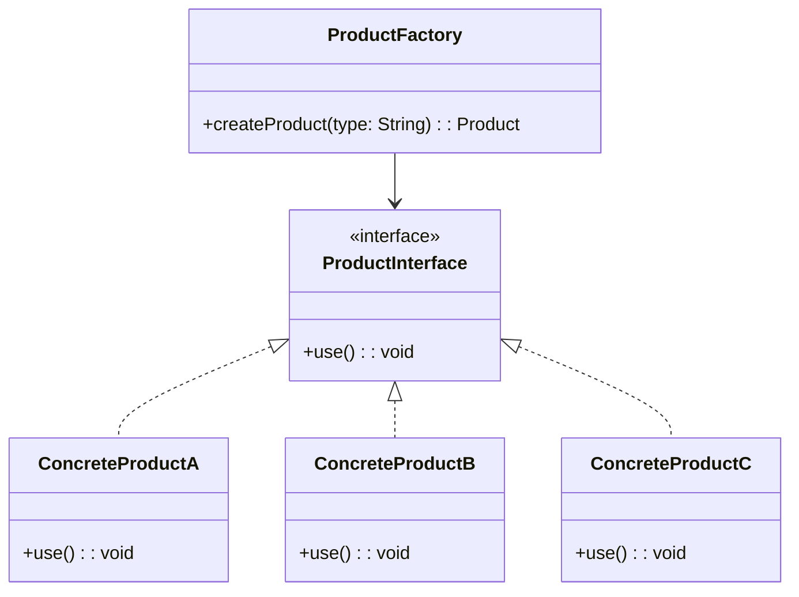

# 设计模式：简单工厂模式

## 类图

## 优点

- 简化了客户端代码，客户端不需要知道具体的产品类。
- 易于扩展，添加新产品只需修改工厂类。

## 缺点

- 工厂类可能会变得庞大，难以维护。
- 如果产品种类过多，工厂类的逻辑可能会变得复杂。
- 违反了开闭原则，添加新产品需要修改工厂类。

## 扩展

- 可以使用反射机制来动态创建产品，减少工厂类的代码量。
- 可以结合其他设计模式，如策略模式或工厂方法模式，来增强灵活性和可扩展性。
- 可以使用配置文件或数据库来管理产品类型，进一步减少代码耦合。