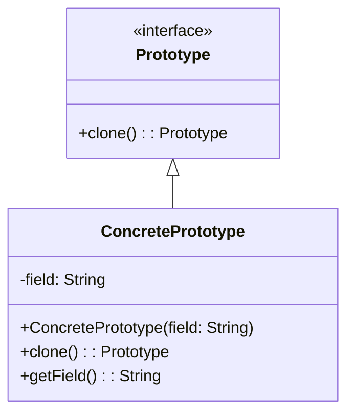

# 原型模式（Prototype）

## 简介

原型模式是一种创建型设计模式，它通过复制现有对象来创建新对象，而不是通过实例化类来创建新对象。这样可以提高性能，尤其是在创建复杂对象时。

## UML 类图

```mermaid
classDiagram
    class Prototype {
        <<interface>>
        +clone(): Prototype
    }
    class ConcretePrototype {
        -field: String
        +ConcretePrototype(field: String)
        +clone(): Prototype
        +getField(): String
    }
    Prototype <|-- ConcretePrototype
```