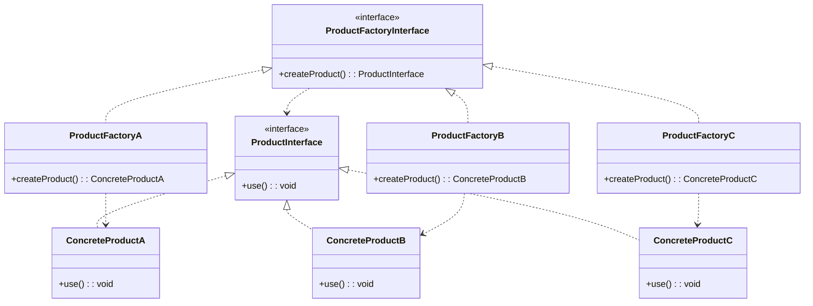

# 设计模式：工厂方法模式

## 类图

```mermaid
classDiagram
    class ProductFactoryInterface {
        <<interface>>
        +createProduct(): ProductInterface
    }
    class ProductFactoryA {
        +createProduct(): ConcreteProductA
    }
    class ProductFactoryB {
        +createProduct(): ConcreteProductB
    }
    class ProductFactoryC {
        +createProduct(): ConcreteProductC
    }
    ProductFactoryInterface <|.. ProductFactoryA
    ProductFactoryInterface <|.. ProductFactoryB
    ProductFactoryInterface <|.. ProductFactoryC

    class ProductInterface {
        <<interface>>
        +use(): void
    }

    class ConcreteProductA {
        +use(): void
    }
    class ConcreteProductB {
        +use(): void
    }
    class ConcreteProductC {
        +use(): void
    }
    
    ProductFactoryInterface ..> ProductInterface
    ProductInterface <|.. ConcreteProductA
    ProductInterface <|.. ConcreteProductB
    ProductInterface <|.. ConcreteProductC
    ProductFactoryA ..> ConcreteProductA
    ProductFactoryB ..> ConcreteProductB
    ProductFactoryC ..> ConcreteProductC
```