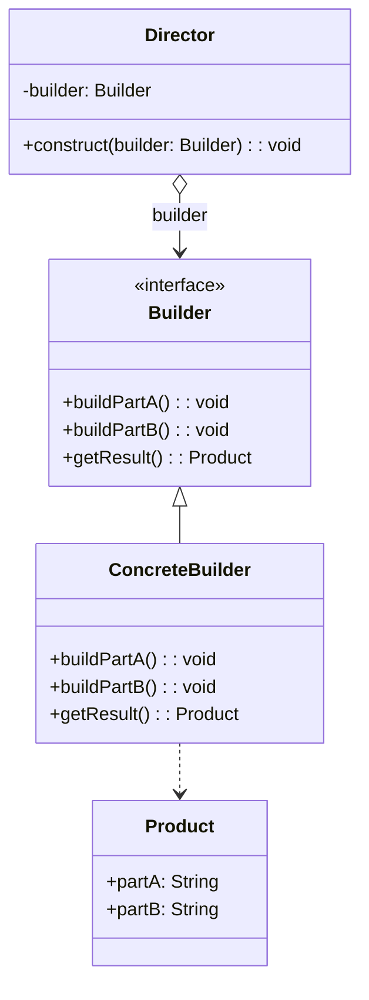

# 建造者模式（Builder）

## 简介

建造者模式是一种创建型设计模式，旨在将一个复杂对象的构建与其表示分离，使得同样的构建过程可以创建不同的表示。它允许使用相同的构建代码创建不同类型的对象。

## UML 类图

```mermaid
classDiagram
    class Director {
        -builder: Builder
        +construct(builder: Builder): void
    }
    class Builder {
        <<interface>>
        +buildPartA(): void
        +buildPartB(): void
        +getResult(): Product
    }
    class ConcreteBuilder {
        +buildPartA(): void
        +buildPartB(): void
        +getResult(): Product
    }
    class Product {
        +partA: String
        +partB: String
    }
    Director o--> Builder: builder
    Builder <|-- ConcreteBuilder
    ConcreteBuilder ..> Product
```