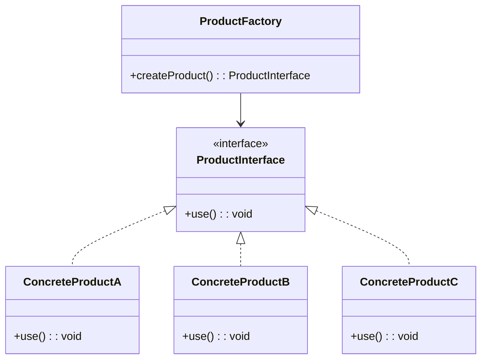

# 设计模式：工厂方法模式

## 类图

```mermaid
classDiagram
    class ProductFactory {
        +createProduct(): ProductInterface
    }

    class ProductInterface {
        <<interface>>
        +use(): void
    }

    class ConcreteProductA {
        +use(): void
    }
    class ConcreteProductB {
        +use(): void
    }
    class ConcreteProductC {
        +use(): void
    }
    
    ProductFactory --> ProductInterface
    ProductInterface <|.. ConcreteProductA
    ProductInterface <|.. ConcreteProductB
    ProductInterface <|.. ConcreteProductC
```