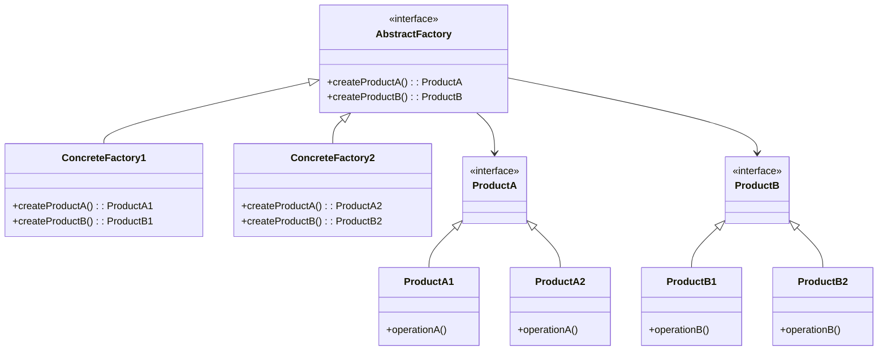

# 抽象工厂模式（Abstract Factory）

## 简介

抽象工厂模式是一种创建型设计模式，提供一个接口，用于创建一系列相关或相互依赖的对象，而无需指定它们具体的类。它通常用于需要创建多个相关对象的场景。

## UML 类图

## 缺点

- 增加新的产品族时，需要修改抽象工厂接口和所有具体工厂类，违反了开闭原则。
- 由于每个具体工厂都需要实现所有产品的创建方法，导致代码冗长且难以维护。

## 另辟蹊径

使用 **反射 + 工厂** 方法，可以在不修改现有代码的情况下，动态创建产品对象，从而提高系统的灵活性和可扩展性。
