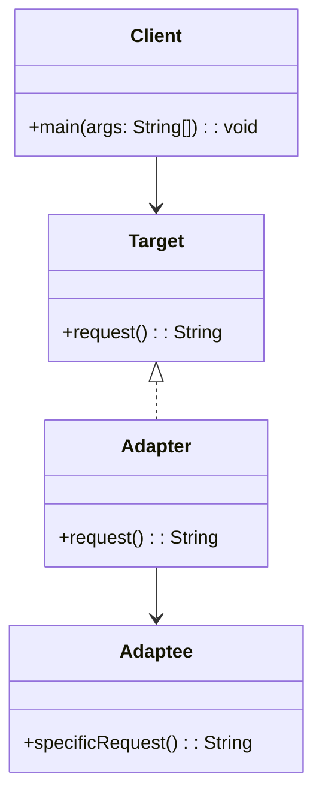

# 适配器模式（Adapter）

## 简介

适配器模式是一种结构型设计模式，旨在将一个类的接口转换成客户期望的另一个接口。适配器模式使得原本由于接口不兼容而不能一起工作的类可以协同工作。

## UML 类图

```mermaid
classDiagram
    class Target {
        +request(): String
    }
    class Adaptee {
        +specificRequest(): String
    }
    class Adapter {
        +request(): String
    }
    class Client {
        +main(args: String[]): void
    }
    Target <|.. Adapter
    Adapter --> Adaptee
    Client --> Target
```
