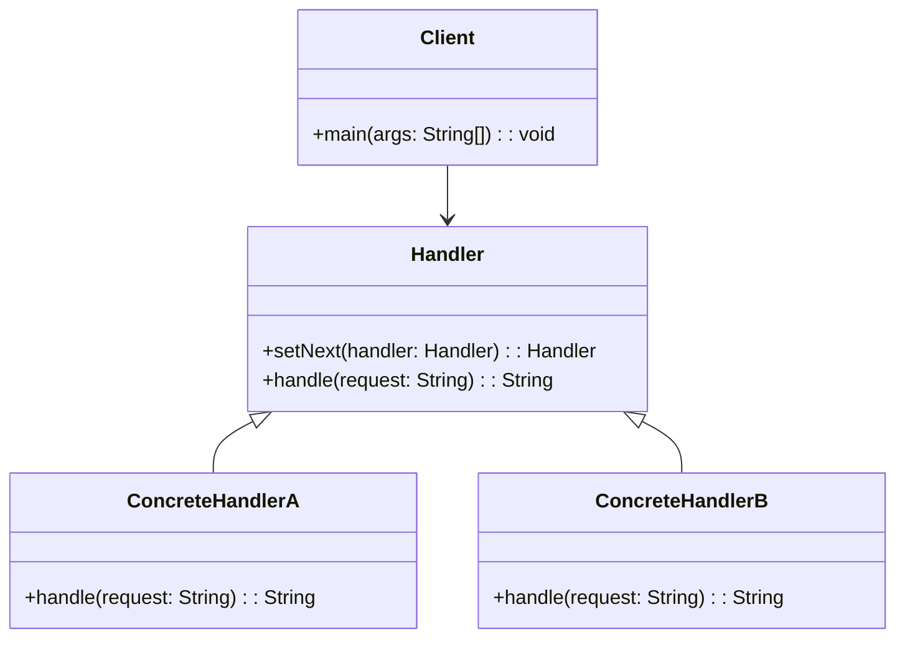

# 责任链模式（Chain of Responsibility）

## 简介

责任链模式是一种行为型设计模式，它允许多个对象有机会处理请求，从而避免请求发送者和接收者之间的耦合关系。请求沿着链传递，直到有一个对象处理它为止。

## UML 类图

```mermaid
classDiagram
    class Handler {
        +setNext(handler: Handler): Handler
        +handle(request: String): String
    }
    class ConcreteHandlerA {
        +handle(request: String): String
    }
    class ConcreteHandlerB {
        +handle(request: String): String
    }
    class Client {
        +main(args: String[]): void
    }
    Handler <|-- ConcreteHandlerA
    Handler <|-- ConcreteHandlerB
    Client --> Handler
```
