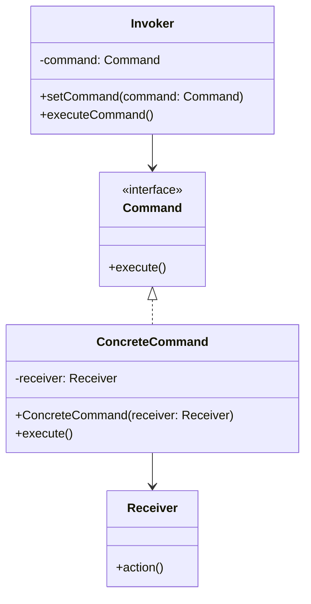

# 命令模式（Command）

## 简介

命令模式是一种行为型设计模式，它将请求封装为一个对象，从而使您可以用不同的请求对客户进行参数化。命令模式允许将请求的发送者与请求的接收者解耦，使得请求可以被存储、传递和执行。

## UML 类图

```mermaid
classDiagram
    class Command {
        <<interface>>
        +execute()
    }

    class ConcreteCommand {
        -receiver: Receiver
        +ConcreteCommand(receiver: Receiver)
        +execute()
    }

    class Receiver {
        +action()
    }

    class Invoker {
        -command: Command
        +setCommand(command: Command)
        +executeCommand()
    }

    Command <|.. ConcreteCommand
    ConcreteCommand --> Receiver
    Invoker --> Command
```
