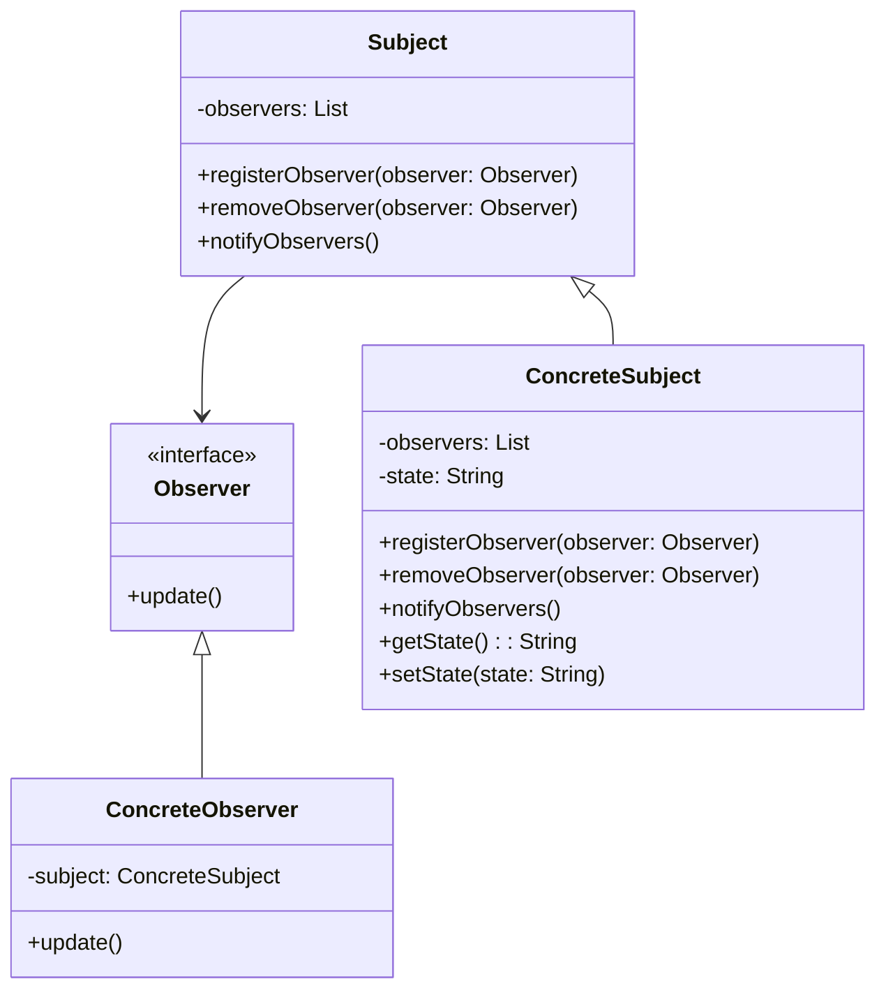

# 观察者模式（Observer）

观察者模式是一种行为型设计模式，用于定义对象之间的一对多依赖关系，使得当一个对象状态发生变化时，所有依赖于它的对象都得到通知并自动更新。

## 参与者

- **Subject（主题）**：被观察的对象，维护一系列观察者，并提供注册、注销观察者的方法。
- **Observer（观察者）**：定义一个更新接口，用于接收主题的通知。
- **ConcreteSubject（具体主题）**：实现主题接口，存储观察者列表，并在状态变化时通知所有观察者。
- **ConcreteObserver（具体观察者）**：实现观察者接口，定义接收通知后的具体行为。

## 类图

