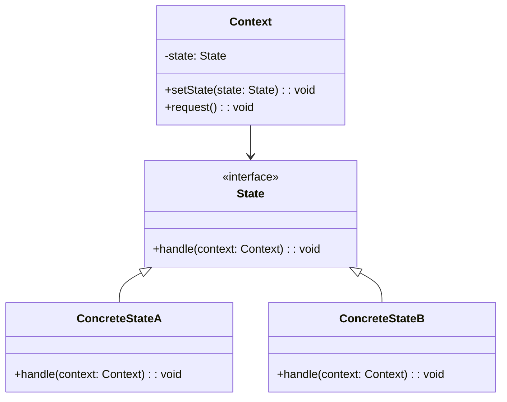

# 状态模式（State）

## 简介

状态模式是一种行为设计模式，它允许对象在内部状态改变时改变其行为。状态模式将对象的状态封装在独立的类中，使得对象可以在不同的状态下表现出不同的行为。

## UML 类图

```mermaid
classDiagram
    class State {
        <<interface>>
        +handle(context: Context): void
    }
    class ConcreteStateA {
        +handle(context: Context): void
    }
    class ConcreteStateB {
        +handle(context: Context): void
    }
    class Context {
        -state: State
        +setState(state: State): void
        +request(): void
    }
    State <|-- ConcreteStateA
    State <|-- ConcreteStateB
    Context --> State
```