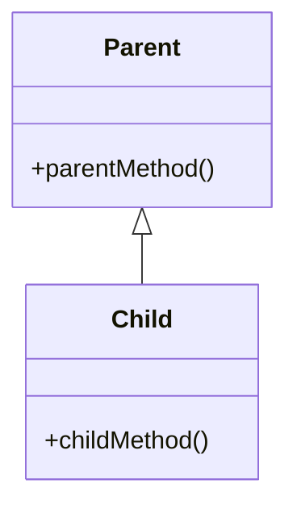
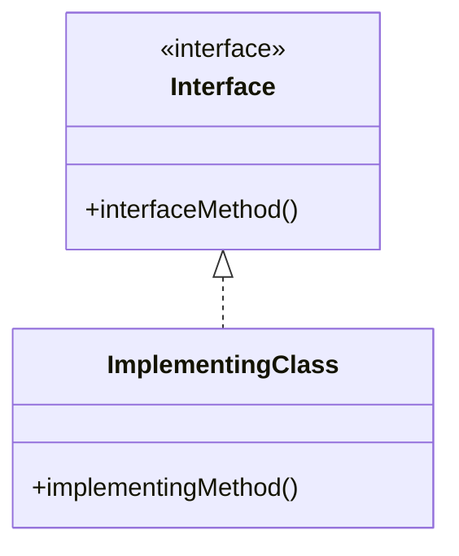
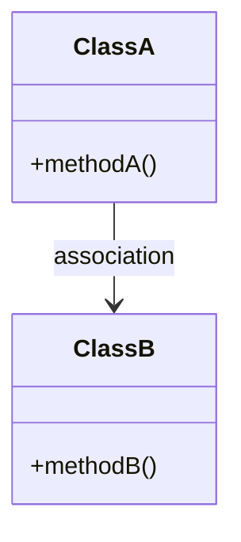
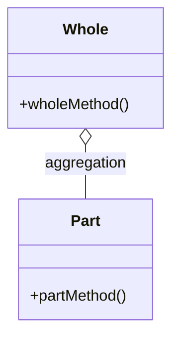
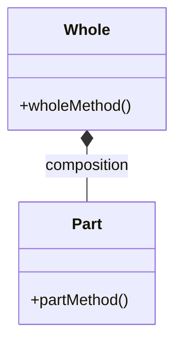
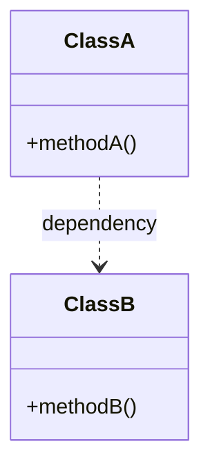

# UML 类图

## 类关系

### 继承

继承关系表示一个类是另一个类的子类，子类继承父类的属性和方法。

`A <|-- B` 表示类 B 继承自类 A。

### 实现

实现关系表示一个类实现了一个接口，接口定义了一组方法，类必须提供这些方法的具体实现。

`A <|.. B` 表示类 B 实现了接口 A。

### 关联

关联关系表示一个类与另一个类之间的联系，通常通过属性来实现。

`A --> B` 表示类 A 与类 B 之间存在关联关系。

### 聚合

聚合关系表示一个类是另一个类的一部分，但两者可以独立存在。

`A o-- B` 表示类 A 聚合了类 B。

### 组合

组合关系表示一个类是另一个类的一部分，且两者的生命周期绑定在一起。

`A *-- B` 表示类 A 组合了类 B。

### 依赖

依赖关系表示一个类使用另一个类，但不拥有它，通常通过方法参数或局部变量来实现。

`A ..> B` 表示类 A 依赖于类 B。

